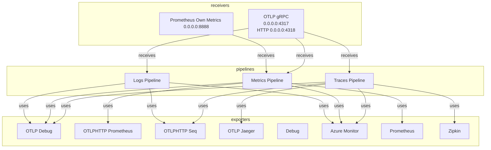
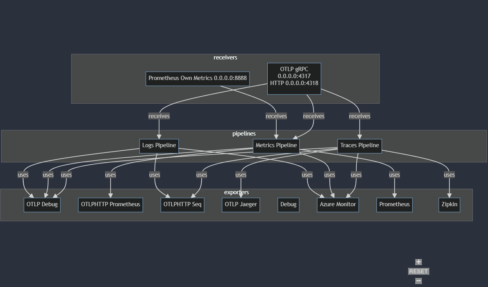

```mermaid
graph TD;
    subgraph receivers
    otlp[OTLP gRPC\n0.0.0.0:4317\nHTTP 0.0.0.0:4318]
    prometheus_metrics[Prometheus Own Metrics 0.0.0.0:8888]
    end

    subgraph exporters
    otlp_debug[OTLP Debug]
    otlphttp_prometheus[OTLPHTTP Prometheus]
    otlphttp_seq[OTLPHTTP Seq]
    otlp_jaeger[OTLP Jaeger]
    debug_exporter[Debug]
    azuremonitor[Azure Monitor]
    prometheus_exporter[Prometheus]
    zipkin[Zipkin]
    end

    subgraph pipelines
    traces_pipeline[Traces Pipeline]
    metrics_pipeline[Metrics Pipeline]
    logs_pipeline[Logs Pipeline]
    end

    %% Connections
    otlp -->|receives| traces_pipeline
    otlp -->|receives| metrics_pipeline
    otlp -->|receives| logs_pipeline
    prometheus_metrics -->|receives| metrics_pipeline

    %% Pipelines to Exporters mapping
    traces_pipeline -->|uses| otlp_debug
    traces_pipeline -->|uses| otlphttp_seq
    traces_pipeline -->|uses| azuremonitor
    traces_pipeline -->|uses| otlp_jaeger
    traces_pipeline -->|uses| zipkin

    metrics_pipeline -->|uses| otlp_debug
    metrics_pipeline -->|uses| prometheus_exporter
    metrics_pipeline -->|uses| otlphttp_prometheus
    metrics_pipeline -->|uses| azuremonitor

    logs_pipeline -->|uses| otlp_debug
    logs_pipeline -->|uses| otlphttp_seq
    logs_pipeline -->|uses| azuremonitor
```

Exported:
[]